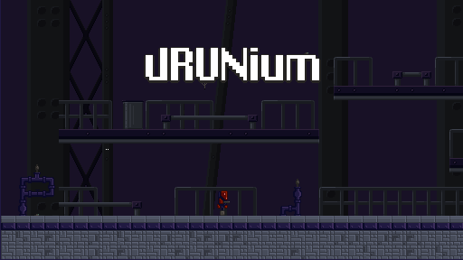

# LD39

 -brightgreen.svg)

</img>

## Setup

To setup the game folder, run `npm install` at root.

## Play

It is advised to use a local web server to play.

If `serve` isn't installed, just type `npm install -g serve` anywhere.

Run `serve` at root to create a local server.